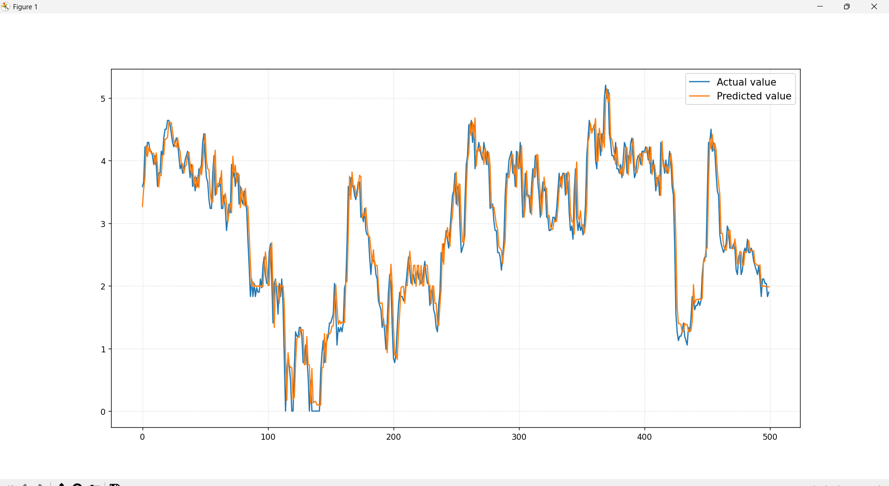

# 電力用変圧器オイル温度（OT）予測 PoC

本リポジトリは、各種センサデータを活用した変圧器オイル温度（OT）の将来予測に関する技術検証（PoC）の成果物です。

## 1. 検証概要
- **目的**: 経験則に基づく単純な閾値監視から、予測に基づく「予防保全」への移行の妥当性を検証。
- **データセット**: 公開ベンチマークであるETT（Electricity Transformer Temperature）データセット（15分刻み系列データ）。
- **ターゲット**: オイル温度（OT）の1ステップ先（15分先）予測。

## 2. 成果物一覧
1. `analysis.py`: 
   - 統計的解析（ADF検定、ACF/PACF、STL分解）に基づく特徴量エンジニアリング
   - LightGBMによる学習および 5-Fold 時系列クロスバリデーション（`TimeSeriesSplit`）評価コード
2. `PoC_Report.pdf`: 
   - スライド

## 3. 簡易検証結果
- **予測精度**: 検証データに対して**誤差二乗平均（MSE）0.3度**を達成。
- **堅牢性評価**: 5-Fold時系列交差検証（CV）の結果、データ量の蓄積に伴って予測誤差および最大残差（外れ値）が劇的に収束することを確認済み。

### 【実測値と予測値の比較プロット】


## 4. 環境構築と実行手順

```bash
# 1. 仮想環境の作成
python -m venv .venv

# 2. 仮想環境のアクティベート
# Windows (PowerShell) の場合
PowerShell -ExecutionPolicy Bypass -File .venv\Scripts\Activate.ps1
# Mac / Linux の場合
source .venv/bin/activate

# 3. ライブラリのインストール
pip install -r requirements.txt

# 4. スクリプトの実行
python analysis.py
